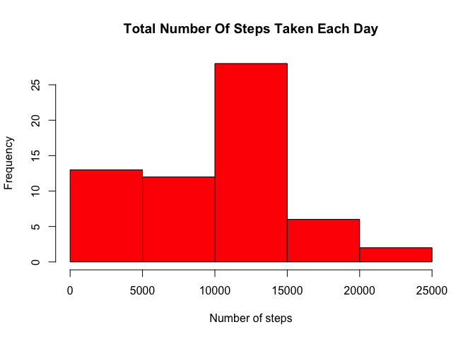
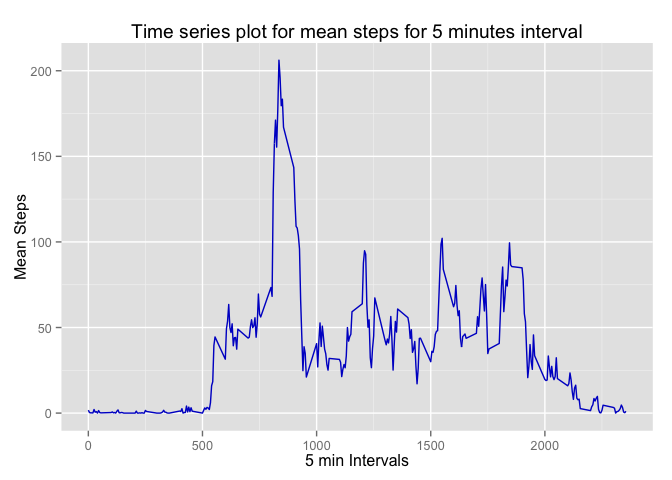
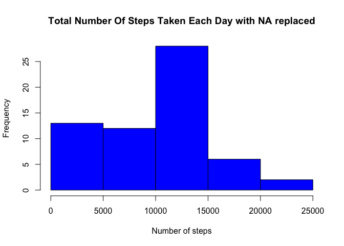
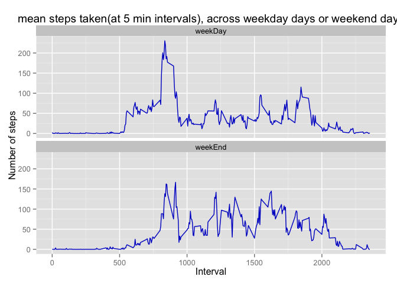

# Reproducible Research: Peer Assessment 1


## Loading and preprocessing the data
Code to read the data

```r
options(gsubfn.engine = "R")
library(sqldf)
```

```
## Loading required package: gsubfn
## Loading required package: proto
## Loading required package: RSQLite
## Loading required package: DBI
```

```r
activityData <- read.csv.sql("./activity.csv", sql="select * from file")
```

```
## Warning: closing unused connection 5 (./activity.csv)
```

```r
baseData <- activityData
```
Transform activity data

```r
activityData$steps <- as.numeric(activityData$steps)
```

```
## Warning: NAs introduced by coercion
```

## What is mean total number of steps taken per day?
calculate value of total steps for dates

```r
countOfStepsDayWise <- aggregate(activityData$steps, 
                                 FUN= sum, 
                                 by=list(activityData$date),
                                 na.rm=TRUE)
## give names to columns
colnames(countOfStepsDayWise) <- c("day","CountOfSteps")
## plot histogram of count of steps
hist(countOfStepsDayWise$CountOfSteps, 
     main = "Total Number Of Steps Taken Each Day",
     xlab = "Number of steps", 
     col = "red")
```

 

```r
## caluclate mean of steps
meanSteps <- mean(countOfStepsDayWise$CountOfSteps)
## calculate median of steps
medianSteps <- median(countOfStepsDayWise$CountOfSteps)
```

**Mean** of total number of steps taken per day =  **9354.23**

**Median** of total number of steps taken per day = **10395**


## What is the average daily activity pattern?

```r
meanStepsFor5MinInterval <- aggregate(activityData$steps, 
                                 FUN= mean, 
                                 by=list(activityData$interval),
                                 na.rm=TRUE)
## give names to columns
colnames(meanStepsFor5MinInterval) <- c("intervals","meanSteps")
## draw time series plot
library(ggplot2)
ggplot(meanStepsFor5MinInterval, aes(x=intervals, y=meanSteps))+
        ggtitle("Time series plot for mean steps for 5 minutes interval")+
        xlab("5 min Intervals")+
        ylab("Mean Steps")+
        geom_line(colour="#0000CC")
```

 

```r
maxInterval <- sqldf("select max(meanSteps) as maxMean, intervals from meanStepsFor5MinInterval")
```
**5 minute Interval** having **maximum** mean steps = **835** and has mean steps = **206.1698113**

## Imputing missing values

```r
missingValues <- sqldf("select count(steps) as missingValue from baseData where steps is \"NA\"")
```
Total number of **missing** values = **2304**

Replace NAs with mean steps

```r
noOfRows <- dim(meanStepsFor5MinInterval)[1]
for(ctr in 1:noOfRows) {
        activityData$steps[is.na(activityData$steps) & 
        activityData$interval == meanStepsFor5MinInterval[ctr , "intervals"]] <-   meanStepsFor5MinInterval[ctr, "meanSteps"]
}
```
Plot histogram with replaced values

```r
updatedCountOfStepsDayWise <- aggregate(activityData$steps, 
                                 FUN= sum, 
                                 by=list(activityData$date),
                                 na.rm=TRUE)
## give names to columns
colnames(updatedCountOfStepsDayWise) <- c("day","CountOfSteps")
## plot histogram of count of steps
hist(countOfStepsDayWise$CountOfSteps, 
     main = "Total Number Of Steps Taken Each Day with NA replaced",
     xlab = "Number of steps", 
     col = "blue")
```

 

```r
## caluclate mean of steps
updatedMeanSteps <- mean(updatedCountOfStepsDayWise$CountOfSteps)
## calculate median of steps
updatedMedianSteps <- median(updatedCountOfStepsDayWise$CountOfSteps)
```
With NAs replaced **Mean** total number of steps taken = **10766.19**
With NAs replaced **Median** total number of steps taken = **10766.19**
Do these values differ from the estimates from the first part of the assignment?
**Yes**
What is the impact of imputing missing data on the estimates of the total daily number of steps?
**Mean and median have increased and converged in values**

## Are there differences in activity patterns between weekdays and weekends?

```r
activityData$date<-as.character(activityData$date)
activityData$date <- as.Date(activityData$date, format = "\"%Y-%m-%d\"")
activityData$weekDay <- weekdays(activityData$date) 
activityDataWeekDaySubset <-sqldf("select * from activityData where weekDay != \"Saturday\" and weekDay != \"Sunday\"")
activityDataWeekEndSubset <-sqldf("select * from activityData where weekDay = \"Saturday\" or weekDay = \"Sunday\"")
meanWeekDayStepsFor5MinInterval <- aggregate(activityDataWeekDaySubset$steps, 
                                 FUN= mean, 
                                 by=list(activityDataWeekDaySubset$interval),
                                 na.rm=TRUE)
## give names to columns
colnames(meanWeekDayStepsFor5MinInterval) <- c("intervals","meanSteps")
meanWeekEndStepsFor5MinInterval <- aggregate(activityDataWeekEndSubset$steps, 
                                 FUN= mean, 
                                 by=list(activityDataWeekEndSubset$interval),
                                 na.rm=TRUE)
## give names to columns
colnames(meanWeekEndStepsFor5MinInterval) <- c("intervals","meanSteps")
meanWeekDayStepsFor5MinInterval$weekDay <- c("weekDay")
meanWeekEndStepsFor5MinInterval$weekDay <- c("weekEnd")

meanStepsMerged <- rbind(meanWeekEndStepsFor5MinInterval,meanWeekDayStepsFor5MinInterval)
# plot time series
library(ggplot2)
ggplot(meanStepsMerged,aes(x=intervals, y=meanSteps,group=weekDay))+
        ggtitle("mean steps taken(at 5 min intervals), across weekday days or weekend days")+
        xlab("Interval")+
        ylab("Number of steps")+
        facet_wrap(~weekDay,nrow=2)+
        geom_line(colour="#0000CC")
```

 
**Yes activity patterns differ on weekdays and weekends**
